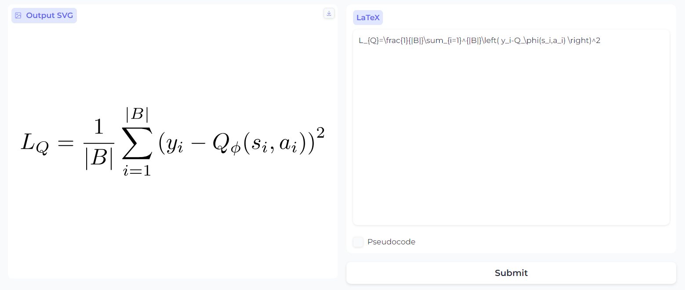
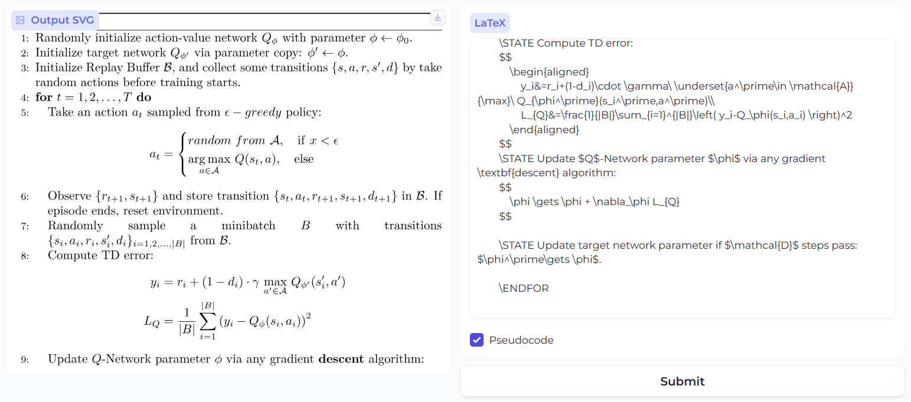
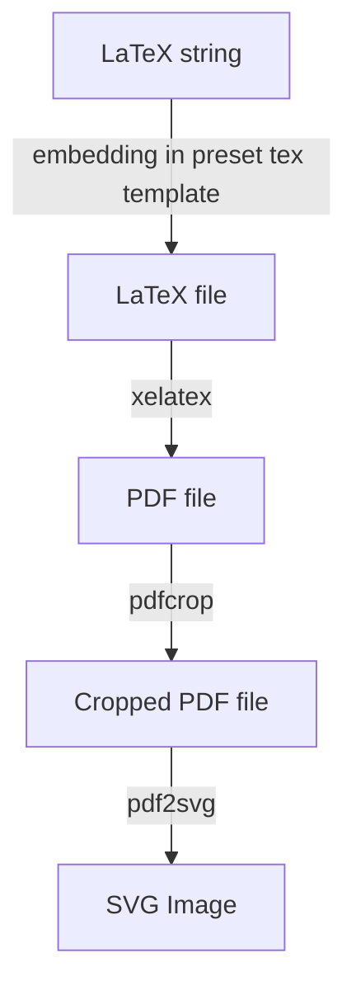
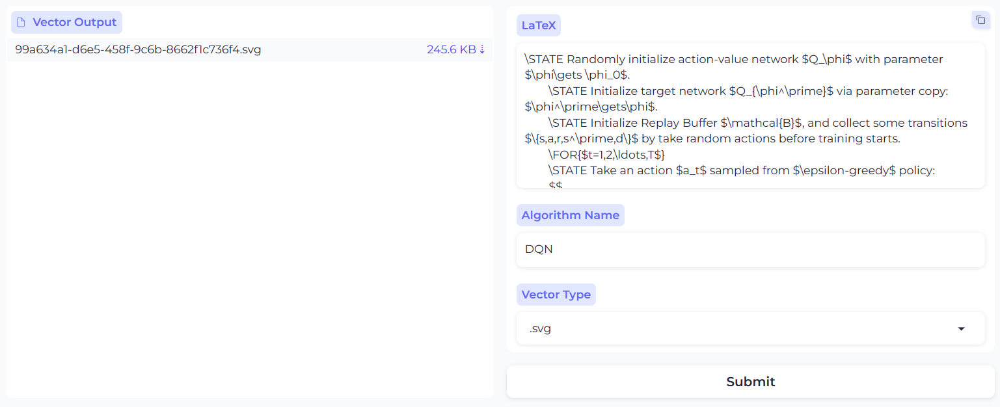

LaTeX2SVG
> a typical pipeline converting LaTeX equation to SVG image, accessed by API or WebUI, just a toy
>
> support two mode:
>
> - simple LaTeX equation
>
>   
>
> - pseudocode with `algorithmic` grammar
>
>   



### How to use

1. install `Texlive` and `pdf2svg`
```bash
sudo apt-get install texlive-full
sudo apt-get install texlive-xetex
sudo apt-get install pdf2svg
```
3. install `fastapi` for API access, `jinja2` for template matching

```bash
pip install fastapi jinja2 uvicorn latex2mathml
```
4. start server

```bash
uvicorn serve:app --port 8000 --host 0.0.0.0
```
5. now you can use via `HTTP POST` request via any client, for example, `curl`:

```bash
curl -X POST \
  -H "Content-Type: application/json" \
  --data '{
    "latex_cmd": "L_{Q}=\\frac{1}{|B|}\\sum_{i=1}^{|B|}\\left( y_i-Q_\\phi(s_i,a_i) \\right)^2",
    "type": "simple",
    "download": "false"
  }' \
  http://127.0.0.1:8000/latex2svg/
```
response:
```
<?xml version="1.0" encoding="UTF-8"?>
<svg xmlns="http://www.w3.org/2000/svg" xmlns:xlink="http://www.w3.org/1999/xlink" width="145pt" height="42pt" viewBox="0 0 145 42" version="1.1">
<defs>
<g>
<symbol overflow="visible" id="glyph0-0">
<path style="stroke:none;" d=""/>
</symbol>
<symbol overflow="visible" id="glyph0-1">
<path style="stroke:none;
...

```
save the svg code to file, you can get the svg image:<br>


Besides, if you request from a browser, and set query param `download=true`, the svg image will be downloaded automatically.

6. install `Gradio` for WebUI access,  the project provides a simple UI built by [Gradio](https://www.gradio.app/)

```bash
pip install gradio
python ui.py
```
Gradio UI will start at 8001 port.



