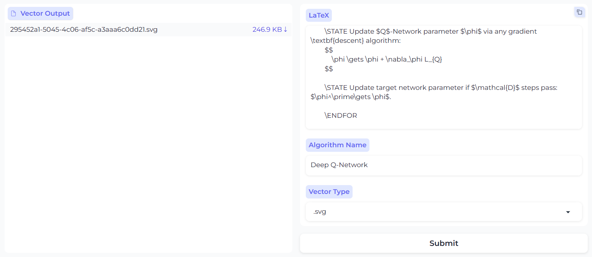

LaTeX2SVG
> a typical pipeline converting LaTeX equation to SVG image, accessed by API or WebUI, just a toy
>
> support two mode:
>
> - simple LaTeX equation
>
>   
>
> - pseudocode with `algorithmic` grammar
>
>   


### How to use

1. install `Texlive` and `pdf2svg`
```bash
sudo apt-get install texlive-full
sudo apt-get install texlive-xetex
sudo apt-get install pdf2svg
```
3. install `fastapi` for API access

```bash
pip install fastapi uvicorn latex2mathml
```
4. start server

```bash
uvicorn serve:app --port 8000 --host 0.0.0.0
```
5. now you can use via `HTTP GET` request via any client, for example, `curl`:

```bash
curl 'http://127.0.0.1:8000/latex2svg/?latex_cmd=L_%7BQ%7D=%5Cfrac%7B1%7D%7B%7CB%7C%7D%5Csum_%7Bi=1%7D%5E%7B%7CB%7C%7D%5Cleft%28%20y_i-Q_%5Cphi%28s_i,a_i%29%20%5Cright%29%5E2&download=false'
```
response:
```
<?xml version="1.0" encoding="UTF-8"?>
<svg xmlns="http://www.w3.org/2000/svg" xmlns:xlink="http://www.w3.org/1999/xlink" width="145pt" height="42pt" viewBox="0 0 145 42" version="1.1">
<defs>
<g>
<symbol overflow="visible" id="glyph0-0">
<path style="stroke:none;" d=""/>
</symbol>
<symbol overflow="visible" id="glyph0-1">
<path style="stroke:none;
...

```
save the svg code to file, you can get the svg image:<br>


Besides, if you request from a browser, and set query param `download=true`, the svg image will be downloaded automatically.

6. install `Gradio` for WebUI access,  the project provides a simple UI built by [Gradio](https://www.gradio.app/)

```bash
pip install gradio
python ui.py
```
Gradio UI will start at 8001 port.


