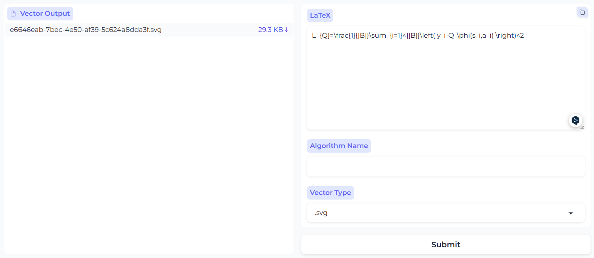

# LaTeX2Vector

A typical pipeline converting LaTeX math equation/pseudocode to vector graphics, accessed by WebUI, just a toy

### Two Mode

- simple LaTeX equation

  

- pseudocode with `algorithmic` grammar

  
  
  
  
### Four Vector Format

- SVG
- PDF
- EPS
- EMF

### Arch


### How to use

1. install `Texlive`
```bash
sudo apt-get install texlive-full
sudo apt-get install texlive-xetex
```
3. install `fastapi` for API access, `jinja2` for template matching

```bash
pip install fastapi jinja2 uvicorn
```
4. start server

```bash
uvicorn server:app --port 8000 --host 0.0.0.0
```
5. install `Gradio` for WebUI access,  the project provides a simple UI built by [Gradio](https://www.gradio.app/)

```bash
pip install gradio
python ui.py
```
Gradio UI will start at 8001 port.


